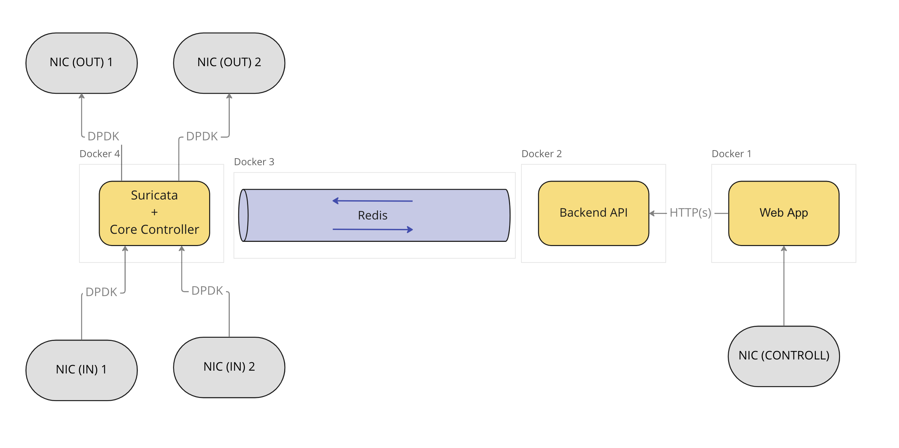
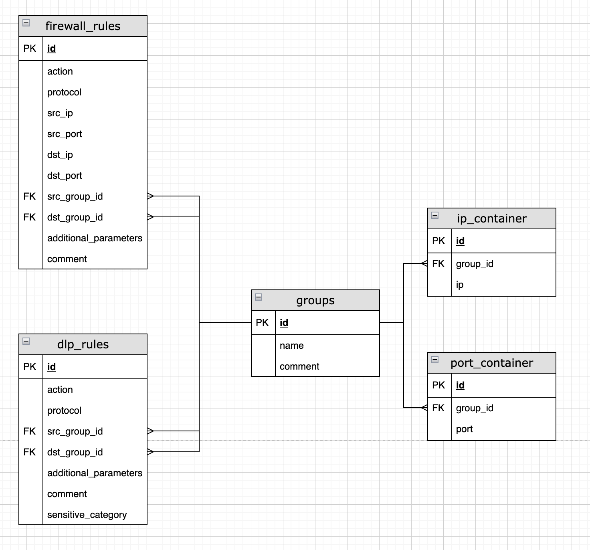

# Liberty Firewall 0.0.1

Status: In Review

# Liberty Firewall 🧑🏼‍💻

## Описание системы

<aside>
💡 ПО Liberty Firewall является NGFW-системой и предназначена для комплексного обеспечения безопасности сети предприятия. Продукт включает в себя традиционные функции файервола, а также расширенные возможности, такие как глубокая проверка трафика и проактивная система обнаружения угроз. Liberty Firewall позволяет компаниям эффективно защищать сети, устройства и приложения от множества опасных атак, таких как уязвимости нулевого дня, программы-вымогатели, вредоносное ПО и другие. Помимо этого система исполняет функции предотвращения и обнаружения вторжений, содержит средства глубокой проверки пакетов (DPI) и распознавания контента (DLP).

1. Межсетевые экраны позволяют настраивать политики сети;
2. Система обнаружения и предотвращения вторжений (IDS/IPS) блокирует использование уязвимостей сети;
3. Система DLP предотвращает утечку ценной/чувствительной информации;
4. Система DPI проводит глубокий анализ пакетов на основе заданных сигнатур;
5. Спам-фильтр обнаруживает и блокирует нежелательные электронные письма, спам и фишинговые атаки;
6. Прокси позволяет скрыть внутреннюю структуру сети;
7. Контент и DNS фильтры позволяют управлять доступом к сайтам и данным с помощью единой панели управления;
8. ПО поддерживает развертывание на кластере для работы в распределенном режиме;
</aside>

## Архитектура

### Список модулей. Описание.

| Название | Модуль | Функция | Статус | Текущая версия |
| --- | --- | --- | --- | --- |
| fw-web-face | Web Application | Пользовательский интерфейс в веб-среде. Доступ к функционалу ПО через UI.  | Разработка | 0.0.1 |
| firewall-api | Backend API | Функционал эндпоинтов системы. Бизнес-логика приложения. Обеспечивает взаимодействие между высокоуровневыми (Web Application) и низкоуровневыми (Core Controller, Suricata) модулями. | Разработка | 0.0.1 |
| fw-core-modules | Core Controller | Обеспечение общения между Backend API и Suricata. Управление жизненным циклом Suricata. | Разработка | 0.0.1 |
| suricata-extended | Suricata | Доработанное open-source ПО Suricata. | Разработка | 0.0.1 |

### Схема отдельной ноды кластера.

### Схема данных

### Web Application 💻

Технологический стек: Java Script, React JS.

Модуль Web App отвечает за визуальное отображение информации пользователю и предоставляет возможность конфигурации и управления Liberty Firewall через взаимодействие с интерфейсом (GUI). Web App является основным средством взаимодействия пользователя с системой.

<aside>
💡 Любой браузер (Yandex, Firefox, Opera, Safari, Chrome) с поддержкой HTML5.

</aside>

### Backend API 🌏

Технологический стек: Java, Spring Boot, Apache Tomcat, H2, Redis.

Модуль является реализацией REST API, и предоставляет доступ к функциям бизнес-логики приложения. Backend API содержит эндпоинты для добавления новых правил и получения информации от ядра. Общение с Web Application происходит по HTTP/HTTPs. Общение с Core Controller происходит через шину данных (message bus) Redis по протоколу TCP/IP. Модуль содержит H2 базу данных для stateless хранения состояний.

### Core Controller 👨🏼‍✈️

Технологический стек: Kotlin, Bash.

Модуль принимает команды от Backend API и управляет жизненным циклом Suricata: запуск, перезагрузка, обновление правил. Считывание команд происходит через Redis Listener по заранее заданному channel.

### Suricata 🐿

Технологический стек: C, Rust, Lua;

Модуль является расширением над open source продуктом Suricata. В версии Liberty Firewall добавлены новые модули распознавания (detectors) для определения нахождения критической (sensitive) информации в потоке сетевых пакетов. Suricata получает траффик напрямую, в обход ядра Linux, благодаря технологии DPDK.

# Реализовано (Release Notes)

| Story 🎯 | Описание 🤔 | Статус 🔥 |
| --- | --- | --- |
| Архитектурная схема One Node | Архитектурная схема ПО при работе на одной ноде с учетом возможности дальнейшего масштабирования.  | Done |
| Запуск Suricata в режиме DPDK | Запуск и настройка Suricata. Работа в режиме DPDK для ускоренной обработки трафика в user space. | Done |
| Модель данных backend | Разработка и реализация схемы данных в Backend API. | Done |
| Модель данных общения | Разработка и реализация модели данных для общения между модулями Backend API и Core Controller. | Done |
| Redis Pub/Sub Backend API | Реализация паблишера и листенера в Backend API. | Done |
| Redis Sub в Сore Сontroller | Реализация паблишера и листенера в Core Controller. | Done |
| Модель API | Разработка модели API. | Done |
| Реализация эндпоинтов backend | Реализация эндпоинтов для управления группами, правилами файервола и правилами DLP. | Done |
| Конвертация правил  | Конвертация правил, полученных из Web App в модель общения. | Done |
| Реализация UI страницы Firewall | Реализовано добавление правил файервола через форму ввода. Реализовано динамическое отображение добавленных правил. Функционал реализован не полностью, дизайн не утвержден и не принят.  | Done |
| Реализация UI страницы DLP | Реализовано добавление правил файервола через форму ввода. Функционал реализован не полностью, дизайн не утвержден и не принят. | Done |
| Реализация самописного модуля Suricata | Реализован самописный DLP модуль и встроен в ядро сурикаты. Модуль работает без ошибок. Функционал реализован не полностью. | Done |
| Реализация управление Suricata в Core Controller | Реализовано управление жизненным циклом Suricata. | Done |

# Технический долг

**Для реализации MVP необходимо закрыть следующие пункты:**

- [ ]  Реализация детекции sensitive-аттрибутов в DLP модуле.
- [ ]  Активация Hyperscan.

# Риски

1. Время на поднятие OvS-DPDK на K8S на текущий момент не поддается оценке (RND);
2. Время обновления правил при добавлении не соответсвует ожиданиям заказчика. Одно из решений по ускорению добавления правил влияет на текущую архитектуру. 
3. Проект имеет зависимость от Suricata open-source version. 
4. Проект на этапе начальной разработки имеет большое количество несмежных технологий и областей знаний. Из-за этого процесс разработки текущим количеством инженеров (2 человека) имеет непоследовательный характер.

# Запуск системы

Для запуска системы необходимо выполнить следующие шаги:

1. Установить DPDK (sudo apt install dpdk)
2. Включить поддержку iommu в ядре Linux
3. Подключить HugePages (минимум 1 Гб)
4. Скачать репозитории:
а) fw-backend-api
б) fw-web-face
в) fw-core-modules
г) suricata-extended (скачать в репозиторий fw-core-modules)
5. Подключить модуль ядра igb_uio
6. Переключить сетевые интерфейсы в режим DPDK (igb_uio)
7. Запустить контейнеры указанные в пункте 4

# Тестирование

Характеристики тестовой среды:

- Генератор нагрузки: виртуальная машина 4 ядра, 6Гб ОЗУ;
- NGFW: виртуальная машина, 6 ядер, 16Гб ОЗУ, 2 сетевых карты, 1 worker сурикаты на сетевую карту.
- Сетевой канал: 82545 EM Gigabit Ethernet Controller (виртуализация), 1 Гбит.

## Нагрузочное (усредненные значения):

- UDP: 71.5 Mbps, нагрузка 140 Kpps, в две стороны
- UDP: 71.5 Mbps, нагрузка 91 Kpps, в одну сторону
- Потоковая передача: 800 Mbps, 91 Kpps

## Скорость добавления правил (усредненные значения):

- Добавление правила к 10 000 существующим: ~ 5с
- Добавление правила к 100 000 существующим: ~ 20с
- Добавление правила к 1 000 000 существующим: ~ 100с
